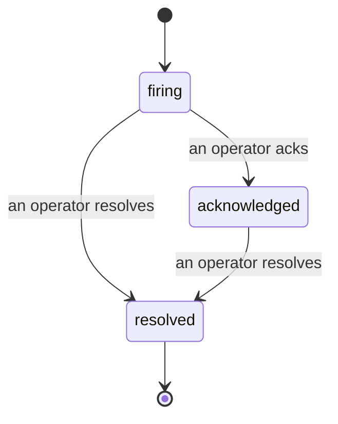

当告警触发时，第一个问题往往是"谁在处理？"事件功能正是为此而生：一旦发生阈值突破，所有人都能看到事件已开启、由谁负责，以及目前发生了什么，并留有清晰、可追溯的记录，可直接用于事后复盘。

*收件箱按状态对开放中的事件分组，并支持按严重级别和负责人筛选，让你第一眼就看到需要人工介入的内容。*

## 一目了然，谁在处理

不再需要在聊天群里追问"有人在看吗？"。阈值突破后，系统会自动创建事件并将其投入共享收件箱，按状态分组展示。确认事件后，你的名字便会出现在上面，团队其他成员即可知晓有人在处理。确认操作支持多人：多名运维人员可以各自确认同一事件，每人的记录独立保存，因此整个"作战室"的成员都能按名字显示，而不会相互覆盖。你可以指定一名负责人进行分级处理，并通过严重级别或负责人筛选收件箱，快速锁定属于你的事件。

## 完整经过，尽在一条时间线

事件结束后，你已经拥有了完整的复盘素材。打开任意事件，你将看到突破证据、负责人与订阅者、用于就地协调的评论区，以及一条只能追加不能修改的活动时间线。

*所有发生过的事情，按时间顺序排列，每一行都标注了操作人。*

每一个动作（开启、确认、解决等）都会写入时间线，且永不被删改。每条记录都有归属标注：操作人通过邮箱标识，FailproofAI Observability 自动执行的操作（如在阈值突破时开启事件）则标注为 **automated**。没有匿名操作，没有信息丢失，事后复盘几乎可以自动完成。

## 事件的流转过程

- **开放中（firing）：** 阈值突破后创建事件，并向你的渠道发送一次通知。后续重复突破会归并到同一事件中，刷新其证据，而不会反复通知你。
- **已确认（acknowledged）：** 某位运维人员接手处理。事件保持开放状态，后续突破会静默更新证据。
- **已解决（resolved）：** 某位运维人员将其关闭。条件恢复正常后自动解决的功能已在规划中，但尚未启用，因此事件会保持开放，直到人工解决——这确保了每个人都能诚实地面对究竟发生了什么。同一告警后续可再次开启新的事件。

同一告警在同一时间最多只有一个开放中的事件，因此频繁抖动的规则不会让你被重复事件淹没。你也可以手动创建事件：可以是与任何告警无关的独立事件（用于捕获未被告警覆盖的问题），也可以关联到已有告警，前提是你拥有 `incidents:write` 权限。

## 访问路径

事件功能位于 `/<org-slug>/incidents`。查看需要 **`incidents:read`** 权限；手动创建事件需要 **`incidents:write`** 权限；确认、指派、评论和解决事件需要 **`incidents:ack`** 权限。已授予已停用的 `alerts:ack` 权限的旧密钥仍然有效，因为系统会将其等同于 `incidents:ack` 处理，因此你的值班轮换无需重新签发。

## 相关内容

- [告警](/zh/agenteye/alerts)：在阈值突破时触发事件创建的规则。
- [错误追踪](/zh/agenteye/error-tracking)：在一处查看所有故障，并可将其提升为告警。
- [审计](/zh/agenteye/audits)：定期运行的分析程序，用于发现未被任何规则监控的故障。